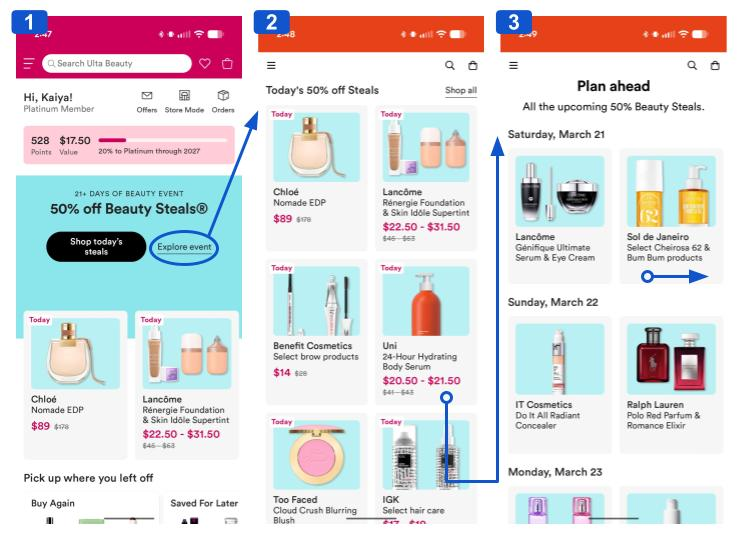
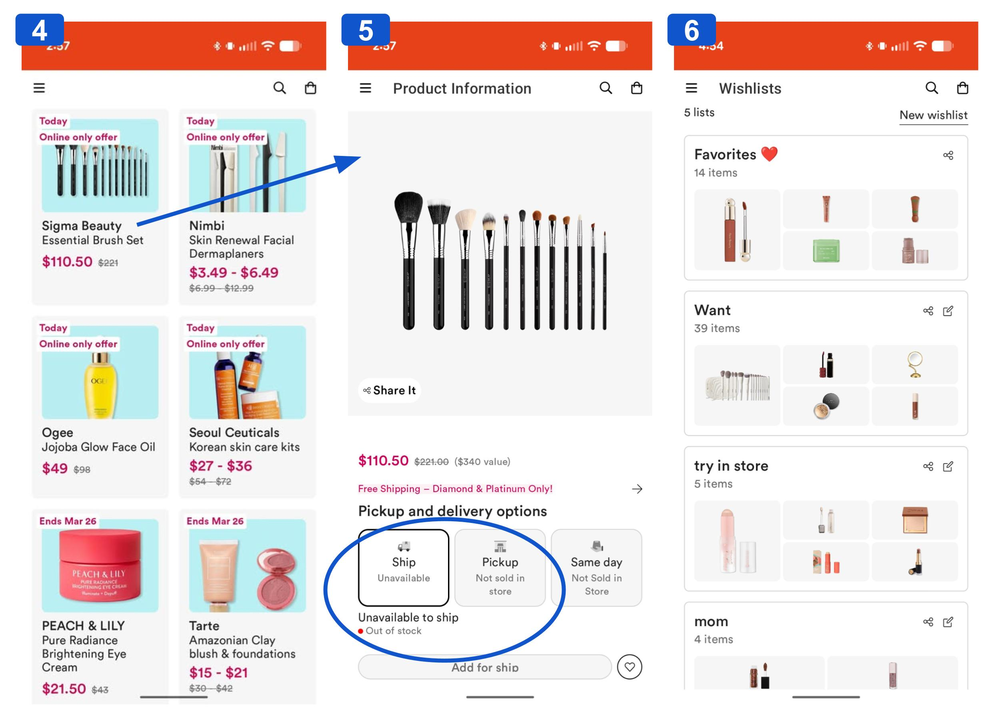
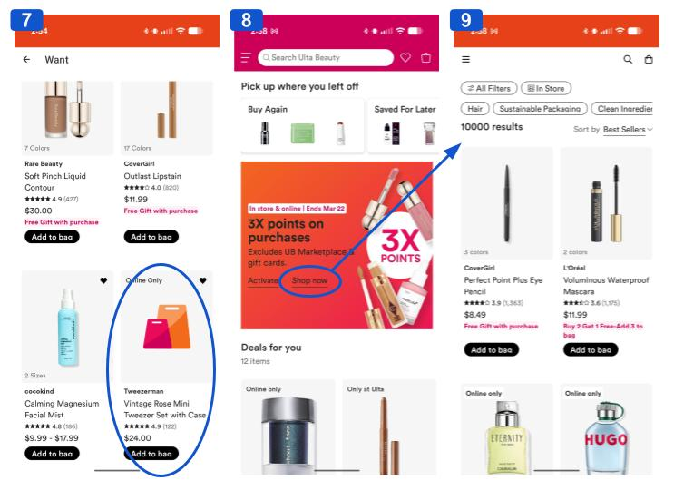
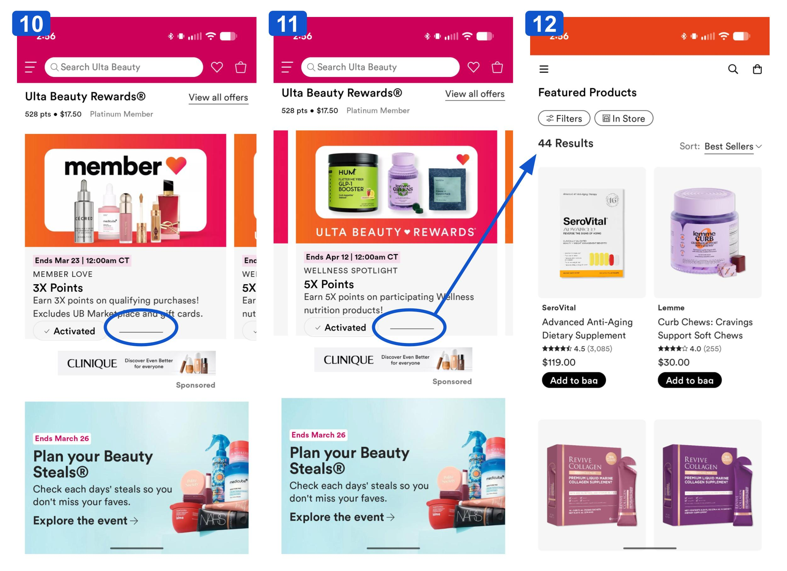

# Ulta 21 Days of Beauty Event!
The Beauty Retailer Ulta Beauty is currently running their annual 21 Days of Beauty Promotion. I used the mobile application to explore the items on sale and decide whether or not I wanted to make a purchase. 

The app opens straight to the home screen **(1)**, where the large text immediently drew my attention to the sale. I am given two options, "shop today's sales" and "explore event". As I want to see all the items that will be on sale, I click "explore event". 

This brings me to a page listing all of those items. They are organized so that today's deals are all displayed **(2)**, and the rest are collasped under each date **(3)**. They're accessable by scrolling sideways, and there's an aditional button to view all at once. Each item is in a seperate box, with an image, name, and price. 

This is similar to the in store experience, demonstrating a [Match Between the System and the Real World](https://www.nngroup.com/articles/ten-usability-heuristics/) Clicking on an item will show more information and provide a way to add to cart. 

